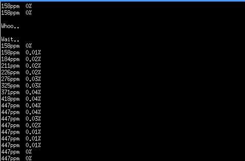

# 알콜 측정기
## 프로젝트 소개
- 알콜 측정 센서와 c#으로 알콜 수치를 측정하는 기능을 구현하였습니다. 출입통제시스템을 통해 입장할 때 알콜센서에 입김을 '후' 불어 알콜 수치를 체크하여 일정수치의 알콜수치가 감지되면 출입이 불가하도록 만드는 기능에 사용되었습니다. 라즈베리파이 환경에서 구동되었으며, 시리얼 통신을 사용하였습니다.

> 테스트용 사진 첨부

</img>
